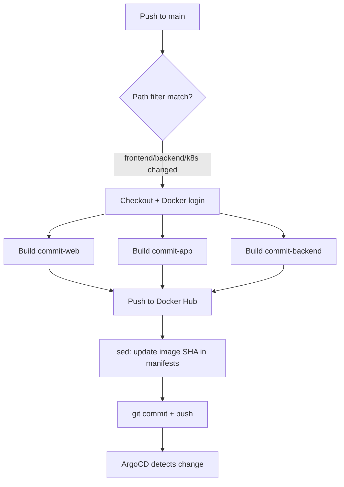

# CI/CD & GitOps

## Philosophy

Commit uses a GitOps deployment model rather than a traditional push-based CI/CD pipeline. GitHub Actions is responsible only for building artifacts (Docker images) and updating the desired state in git. ArgoCD is solely responsible for making the cluster match that desired state. This separation means:

- The cluster's actual state can always be verified against git — there's no drift
- Rollbacks are a `git revert`, not a manual `kubectl` command
- No CI runner ever needs direct cluster credentials
- Every deployment is an auditable git commit

---

## GitHub Actions — CI Pipeline

**File:** `.github/workflows/ci.yml`

**Triggers:**

```yaml
on:
  push:
    branches: [main]
    paths:
      - frontend/**
      - backend/**
      - infra/k8s/**/*.yaml
      - .github/workflows/ci.yml
  workflow_dispatch:
```

Path filters ensure documentation-only changes don't trigger unnecessary image rebuilds. `workflow_dispatch` allows manual triggering from the Actions tab.

**Pipeline steps:**

1. Checkout repository
2. Login to Docker Hub
3. Set up Docker Buildx
4. Build and push `commit-web` (tagged with commit SHA and `latest`), with production `VITE_*` build args
5. Build and push `commit-app` (same pattern, different `VITE_API_URL`)
6. Build and push `commit-backend`
7. Update image tags in `infra/k8s/*/deployment.yaml` to the new commit SHA via `sed`
8. Commit and push the updated manifests back to `main`



**Required GitHub Secrets:**

| Secret | Purpose |
|--------|---------|
| `DOCKERHUB_USERNAME` | Docker Hub login |
| `DOCKERHUB_TOKEN` | Docker Hub access token (scoped, revocable) |

---

## Image Tagging Strategy

Every image is pushed with two tags:

- `rahulkoju/commit-backend:<commit-sha>` — immutable, used in deployment manifests
- `rahulkoju/commit-backend:latest` — convenience tag for manual pulls/debugging

The deployment manifests always reference the SHA tag, never `latest`. This is what makes ArgoCD's sync detection work — `latest` never changes the manifest content, so ArgoCD wouldn't see a diff and wouldn't redeploy. The SHA tag changing on every commit is what triggers the sync.

---

## ArgoCD — GitOps Reconciliation

**Two ArgoCD Applications:**

| Application | Watches | Destination namespace |
|-------------|---------|------------------------|
| `commit` | `infra/k8s/` | `commit` |
| `monitoring` | `infra/monitoring/` | `monitoring` |

**Sync policy (both apps):**

```yaml
syncPolicy:
  automated:
    prune: true
    selfHeal: true
  syncOptions:
    - CreateNamespace=true
```

- `prune: true` — resources removed from git are removed from the cluster
- `selfHeal: true` — if someone manually edits a resource with `kubectl`, ArgoCD reverts it to match git on the next reconciliation loop
- `CreateNamespace=true` — target namespace is created automatically if missing

**What's excluded from the `commit` Application:**

```yaml
directory:
  recurse: true
  exclude: '{cert-manager/cert-manager.yaml,storage/local-path-provisioner.yaml}'
```

cert-manager and local-path-provisioner are one-time cluster bootstrap manifests, not part of the application lifecycle — they're applied manually once per cluster and excluded from ArgoCD's management to avoid large, noisy diffs on every sync.

---

## Secrets — Why They're Never in ArgoCD's Path

`infra/k8s/config/secret.yaml`, `infra/monitoring/alertmanager-secret.yaml`, and `infra/monitoring/grafana-admin-secret.yaml` are all `.gitignore`d. ArgoCD only reconciles what exists in git, so it never sees or touches these files.

This means:
- Secrets must be applied manually with `kubectl apply` once per fresh cluster
- ArgoCD's `selfHeal` doesn't fight with secrets since it doesn't track them
- The cluster will start with `CrashLoopBackOff` on the backend if you forget to apply `secret.yaml` after a fresh deployment — this is expected and resolves once the secret is applied

`.example` versions of every secret file are committed so the required structure is documented without exposing real credentials.

---

## End-to-End Flow Example

A developer changes the Go backend's auth handler:

1. `git push origin main`
2. GitHub Actions triggers (path filter matches `backend/**`)
3. New `commit-backend` image built and pushed to Docker Hub tagged with the commit SHA
4. `infra/k8s/backend/deployment.yaml` is updated with the new SHA, committed as `ci: update image tags to <sha>`, pushed to `main`
5. ArgoCD's next reconciliation loop (default: 3 minutes, or instantly via webhook) detects the manifest diff
6. ArgoCD applies the updated Deployment
7. Kubernetes performs a rolling update — new pods come up, pass readiness probes, old pods terminate
8. Zero downtime, fully automated, fully auditable in git history
