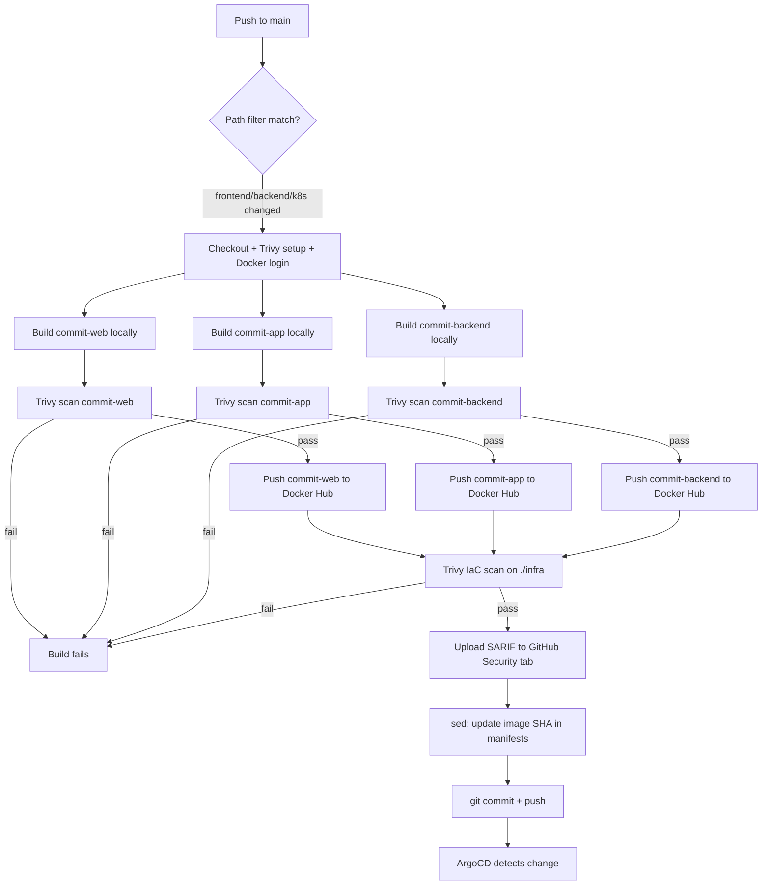

# CI/CD & GitOps

## Philosophy

Commit uses a GitOps deployment model rather than a traditional push-based CI/CD pipeline. GitHub Actions is responsible only for building artifacts (Docker images) and updating the desired state in git. ArgoCD is solely responsible for making the cluster match that desired state. This separation means:

- The cluster's actual state can always be verified against git — there's no drift
- Rollbacks are a `git revert`, not a manual `kubectl` command
- No CI runner ever needs direct cluster credentials
- Every deployment is an auditable git commit

---

## GitHub Actions — CI Pipeline

**File:** `.github/workflows/ci.yml`

**Triggers:**

```yaml
on:
  push:
    branches: [main]
    paths:
      - frontend/**
      - backend/**
      - infra/k8s/**/*.yaml
      - .github/workflows/ci.yml
  workflow_dispatch:
```

Path filters ensure documentation-only changes don't trigger unnecessary image rebuilds. `workflow_dispatch` allows manual triggering from the Actions tab.

**Pipeline steps:**

1. Checkout repository
2. Setup Trivy (v0.72.0, pinned to commit SHA, with caching)
3. Login to Docker Hub
4. Set up Docker Buildx
5. Build `commit-web` locally (`load: true`, `push: false`) with production `VITE_*` build args
6. Scan `commit-web` with Trivy — fail on HIGH/CRITICAL unfixed vulnerabilities (respects `.trivyignore`)
7. Push `commit-web` to Docker Hub (only if scan passes)
8. Build `commit-app` locally (same pattern)
9. Scan `commit-app` with Trivy
10. Push `commit-app` to Docker Hub
11. Build `commit-backend` locally
12. Scan `commit-backend` with Trivy
13. Push `commit-backend` to Docker Hub
14. Generate SARIF report from Trivy IaC scan (`trivy fs --scanners misconfig,secret` on `./infra`)
15. Upload SARIF report to GitHub Security tab
16. Fail the build if IaC scan finds HIGH/CRITICAL misconfigurations or secrets
17. Update image tags in `infra/k8s/*/deployment.yaml` to the new commit SHA via `sed`
18. Commit and push the updated manifests back to `main`



**Required GitHub Secrets:**

| Secret | Purpose |
|--------|---------|
| `DOCKERHUB_USERNAME` | Docker Hub login |
| `DOCKERHUB_TOKEN` | Docker Hub access token (scoped, revocable) |

**Required GitHub Permissions:**

| Permission | Purpose |
|------------|---------|
| `contents: write` | Push updated manifests back to `main` |
| `security-events: write` | Upload Trivy SARIF reports to the repository's Security tab |

---

## Cluster Schedule Workflow

**File:** `.github/workflows/cluster-schedule.yaml`

A separate workflow manages EC2 cluster stop/start independent of the CI pipeline:

```yaml
on:
  workflow_dispatch:
    inputs:
      action:
        description: 'start or stop'
        required: true
        type: choice
        options:
          - start
          - stop
```

**Function:**
- Starts control-plane first, waits for `instance-status-ok`, then starts worker
- Stops worker first, then control-plane (cleaner shutdown)
- Scoped via `configure-aws-credentials` using `AWS_ACCESS_KEY_ID` / `AWS_SECRET_ACCESS_KEY` secrets

**Schedule transition:**
- Previously used `schedule:` cron triggers in this workflow (commented out)
- Replaced by **AWS EventBridge Scheduler** for reliability — see below
- `workflow_dispatch` is retained as a manual fallback for on-demand demos outside the scheduled window

---

## Image Tagging Strategy

Every image is pushed with two tags:

- `rahulkoju/commit-backend:<commit-sha>` — immutable, used in deployment manifests
- `rahulkoju/commit-backend:latest` — convenience tag for manual pulls/debugging

The deployment manifests always reference the SHA tag, never `latest`. This is what makes ArgoCD's sync detection work — `latest` never changes the manifest content, so ArgoCD wouldn't see a diff and wouldn't redeploy. The SHA tag changing on every commit is what triggers the sync.

---

## Trivy — Vulnerability & Misconfiguration Scanning

Trivy is integrated into the CI pipeline as a build gate that blocks deployment of images with known high/critical vulnerabilities and catches infrastructure-as-code misconfigurations.

### Image Scanning

Each Docker image (web, app, backend) is built locally (`load: true`, `push: false`), then scanned with Trivy before being pushed to Docker Hub:

| Setting | Value | Purpose |
|---------|-------|---------|
| `severity` | `HIGH, CRITICAL` | Only high and critical CVEs trigger a failure |
| `ignore-unfixed` | `true` | Skip findings that have no available fix yet |
| `exit-code` | `1` | Fail the step (and the whole job) if findings match |
| `trivyignores` | `.trivyignore` | Respect accepted risk exceptions |

If any image fails the scan, the pipeline stops — the image is never pushed to Docker Hub, and no deployment occurs.

### IaC Scanning

After all images are pushed, Trivy scans the `./infra` directory for misconfigurations and exposed secrets:

```bash
trivy fs \
  --scanners misconfig,secret \
  --severity HIGH,CRITICAL \
  --ignorefile .trivyignore \
  --exit-code 1 \
  ./infra
```

The scan results are uploaded as a **SARIF report** to the GitHub Security tab via `codeql-action/upload-sarif@v4`, giving visibility into findings even for non-blocking scans. The pipeline fails on HIGH/CRITICAL misconfigurations or secrets.

### Trivy Configuration Files

**`.trivyignore`** — Documents accepted risk exceptions with rationale:

| Finding | Rule | Reason |
|---------|------|--------|
| cert-manager cluster-scoped secrets | AVD-KSV-0041 | cert-manager stores issued TLS certs as Secrets — required by design |
| cainjector webhook modifications | AVD-KSV-0114 | CA injection into webhooks is the core function |
| ACME challenge service/ingress management | AVD-KSV-0056 | HTTP-01 solver needs to serve challenge responses |
| Non-default image registry | AVD-KSV-0125 | cert-manager images pulled from quay.io (Jetstack's registry) |
| Public EC2 IP | AVD-AWS-0164 | No NAT gateway budget; ingress restricted to SSH only |
| Open egress on EC2 | AVD-AWS-0104 | EC2 needs outbound HTTPS for registry pulls, ACME, package updates |
| Unencrypted root EBS | AVD-AWS-0131 | Enabling encryption would require instance replacement and data migration |
| Writable root filesystem | AVD-KSV-0014 | local-path-provisioner needs host filesystem write access |
| Elevated filesystem access | AVD-KSV-0118 | local-path-provisioner manages host-backed storage paths |

**`trivy.yaml`** — Skips scanning of sensitive state files that contain credentials or cluster state:

```yaml
scan:
  skip-files:
    - "**/cluster.rkestate"
    - "**/kube_config_cluster.yml"
    - "**/terraform.tfstate"
```

---

## ArgoCD — GitOps Reconciliation

**Two ArgoCD Applications:**

| Application | Watches | Destination namespace |
|-------------|---------|------------------------|
| `commit` | `infra/k8s/` | `commit` |
| `monitoring` | `infra/monitoring/` | `monitoring` |

**Sync policy (both apps):**

```yaml
syncPolicy:
  automated:
    prune: true
    selfHeal: true
  syncOptions:
    - CreateNamespace=true
```

- `prune: true` — resources removed from git are removed from the cluster
- `selfHeal: true` — if someone manually edits a resource with `kubectl`, ArgoCD reverts it to match git on the next reconciliation loop
- `CreateNamespace=true` — target namespace is created automatically if missing

**What's excluded from the `commit` Application:**

```yaml
directory:
  recurse: true
  exclude: '{cert-manager/cert-manager.yaml,storage/local-path-provisioner.yaml}'
```

cert-manager and local-path-provisioner are one-time cluster bootstrap manifests, not part of the application lifecycle — they're applied manually once per cluster and excluded from ArgoCD's management to avoid large, noisy diffs on every sync.

---

## AWS EventBridge Scheduler

The scheduled cluster start/stop is managed natively on AWS rather than via GitHub Actions cron, eliminating reliance on GitHub's shared runner queue.

**Source:** `infra/terraform/modules/scheduler/`

**Components:**
- **Lambda function** (`ec2_scheduler.py`, Python 3.12) — accepts an `action` event (`start`/`stop`), starts control-plane first (waits for `instance_status_ok`), then worker; stops in reverse order
- **EventBridge schedules:**
  - Start: `cron(50 7 * * ? *)` — 7:50am Asia/Kathmandu
  - Stop: `cron(0 0 * * ? *)` — midnight Asia/Kathmandu
- **IAM:** Lambda execution role scoped to `ec2:StartInstances` / `ec2:StopInstances` on only the two managed instance ARNs; `DescribeInstances` / `DescribeInstanceStatus` on `"*"` for the waiter

**Key decisions:**
- GHA `schedule:` triggers were removed because confirmed platform-level delays and dropped runs occurred during high-load UTC windows, causing the morning start to silently not fire
- Timezone is evaluated natively by EventBridge in `Asia/Kathmandu` — no UTC offset math needed

---

## Secrets — Why They're Never in ArgoCD's Path

`infra/k8s/config/secret.yaml`, `infra/monitoring/alertmanager-secret.yaml`, and `infra/monitoring/grafana-admin-secret.yaml` are all `.gitignore`d. ArgoCD only reconciles what exists in git, so it never sees or touches these files.

This means:
- Secrets must be applied manually with `kubectl apply` once per fresh cluster
- ArgoCD's `selfHeal` doesn't fight with secrets since it doesn't track them
- The cluster will start with `CrashLoopBackOff` on the backend if you forget to apply `secret.yaml` after a fresh deployment — this is expected and resolves once the secret is applied

`.example` versions of every secret file are committed so the required structure is documented without exposing real credentials.

---

## End-to-End Flow Example

A developer changes the Go backend's auth handler:

1. `git push origin main`
2. GitHub Actions triggers (path filter matches `backend/**`)
3. New `commit-backend` image built locally
4. Trivy scans the image — passes (no unfixed HIGH/CRITICAL CVEs)
5. Image pushed to Docker Hub tagged with the commit SHA
6. Trivy IaC scan runs on `./infra` — passes (no HIGH/CRITICAL misconfigurations)
7. SARIF report uploaded to GitHub Security tab
8. `infra/k8s/backend/deployment.yaml` is updated with the new SHA, committed as `ci: update image tags to <sha>`, pushed to `main`
9. ArgoCD's next reconciliation loop (default: 3 minutes, or instantly via webhook) detects the manifest diff
10. ArgoCD applies the updated Deployment
11. Kubernetes performs a rolling update — new pods come up, pass readiness probes, old pods terminate
12. Zero downtime, fully automated, fully auditable in git history
