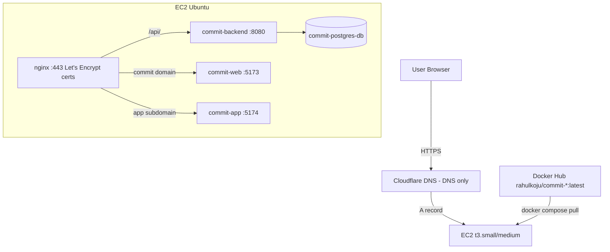

# Compose Deployment Guide

Single-instance deployment of Commit on one EC2 machine using Docker Compose — an alternative to the [Kubernetes setup](deployment.md) for lower-cost or simpler hosting.

> See [Infrastructure](infrastructure.md) for the Kubernetes architecture this complements.

## Overview

| | Kubernetes setup | Compose setup |
|---|---|---|
| Instances | 2× EC2 (control plane + worker) | 1× EC2 |
| Orchestration | RKE Kubernetes + ArgoCD GitOps | Docker Compose + systemd |
| TLS | nginx ingress + cert-manager | host nginx + certbot |
| Image delivery | CI pushes SHA-tagged images, ArgoCD syncs | CI pushes `latest`, host pulls |
| Monitoring stack | Prometheus/Grafana/Loki in-cluster | none (optional) |

The app itself is identical: Go backend, PostgreSQL 16, and two nginx-served React builds (`web` on 5173, `app` on 5174).

---

## Architecture



DNS-only mode means TLS terminates on the EC2 itself — certbot manages Let's Encrypt certificates for both `commit.rahulkoju.com.np` and `app.commit.rahulkoju.com.np`.

---

## 1. Instance Sizing

- **Minimum:** `t3.small` (2 vCPU / 2GB) — runtime-only duty fits comfortably; total container CPU limits are ~1.2 vCPU and idle memory usage is ~700–800MB.
- **Recommended:** `t3.medium` (2 vCPU / 4GB) — same CPU, headroom for Postgres page cache.
- **Never build images on the box** — pnpm/Vite builds want 1.5–2GB+ and will OOM a small instance. Images come from Docker Hub via the prod compose override.
- A 2GB swapfile is added as OOM insurance.

Security group: SSH (22), HTTP (80), HTTPS (443).

## 2. Base Setup (Ubuntu 24.04)

```bash
sudo apt update && sudo apt install -y docker.io docker-compose-v2 nginx certbot python3-certbot-nginx
sudo systemctl enable --now docker nginx
sudo usermod -aG docker $USER   # re-login after

sudo fallocate -l 2G /swapfile && sudo chmod 600 /swapfile
sudo mkswap /swapfile && sudo swapon /swapfile
echo '/swapfile none swap sw 0 0' | sudo tee -a /etc/fstab
```

## 3. Deploy the Stack

Images are **pulled, never built** — CI builds them (see `.github/workflows/ci.yml`). The `docker-compose.prod.yml` override strips `build:` contexts and pins the Docker Hub `:latest` tags.

```bash
git clone git@github.com:RahulKoju/commit.git && cd commit
cp .env.example .env
```

Production `.env` values that must differ from defaults:

| Variable | Value | Why |
|---|---|---|
| `DB_HOST` | `db` | compose service name, not localhost |
| `APP_ENV` | `production` | |
| `ALLOWED_ORIGINS` | `https://commit.rahulkoju.com.np,https://app.commit.rahulkoju.com.np` | browser origins |
| `COOKIE_DOMAIN` | `.rahulkoju.com.np` | leading dot so cookies work on both subdomains |
| `JWT_SECRET` / `DB_PASSWORD` | strong random values | |

```bash
docker compose -f docker-compose.yml -f docker-compose.prod.yml up -d
```

On a fresh machine `up -d` pulls automatically; on updates always `pull` first (see §7).

## 4. Reverse Proxy + TLS

`/etc/nginx/sites-available/commit` — both vhosts proxy `/api/` to the backend and everything else to their static site (the frontend bundles call the API on their own origin):

```nginx
server {
    listen 80;
    server_name commit.rahulkoju.com.np;

    location /api/ {
        proxy_pass http://127.0.0.1:8080;
        proxy_set_header Host $host;
        proxy_set_header X-Real-IP $remote_addr;
        proxy_set_header X-Forwarded-For $proxy_add_x_forwarded_for;
        proxy_set_header X-Forwarded-Proto $scheme;
    }

    location / {
        proxy_pass http://127.0.0.1:5173;
        proxy_set_header Host $host;
    }
}

server {
    listen 80;
    server_name app.commit.rahulkoju.com.np;

    location /api/ {
        proxy_pass http://127.0.0.1:8080;
        proxy_set_header Host $host;
        proxy_set_header X-Real-IP $remote_addr;
        proxy_set_header X-Forwarded-For $proxy_add_x_forwarded_for;
        proxy_set_header X-Forwarded-Proto $scheme;
    }

    location / {
        proxy_pass http://127.0.0.1:5174;
        proxy_set_header Host $host;
    }
}
```

Enable it and issue certificates:

```bash
sudo rm -f /etc/nginx/sites-enabled/default   # drop the catch-all demo vhost
sudo ln -s /etc/nginx/sites-available/commit /etc/nginx/sites-enabled/commit
sudo nginx -t && sudo systemctl reload nginx

sudo certbot --nginx -d commit.rahulkoju.com.np -d app.commit.rahulkoju.com.np
```

Certbot rewrites the config to serve 443 with HTTP→HTTPS redirect; renewal runs on a systemd timer (`certbot renew --dry-run` to verify). Requires DNS records pointing at this instance before running.

## 5. systemd Unit

`/etc/systemd/system/commit.service`:

```ini
[Unit]
Description=Commit app (Docker Compose)
Requires=docker.service
After=docker.service network-online.target

[Service]
Type=oneshot
RemainAfterExit=yes
WorkingDirectory=/home/ubuntu/commit
ExecStart=/usr/bin/docker compose -f docker-compose.yml -f docker-compose.prod.yml up -d
ExecStop=/usr/bin/docker compose -f docker-compose.yml -f docker-compose.prod.yml down
TimeoutStartSec=300

[Install]
WantedBy=multi-user.target
```

```bash
sudo systemctl daemon-reload && sudo systemctl enable --now commit.service
systemctl status commit   # expect: active (exited)
```

### Failure and Restart Coverage

| Failure | Recovered by |
|---|---|
| Instance reboot | `docker.service` → `commit.service` ordering |
| Container crash | `restart: always` in `docker-compose.yml` |
| dockerd crash | systemd restarts it; `restart: always` containers return |
| nginx crash | starts on boot only; add `Restart=on-failure` via `systemctl edit nginx` if wanted |
| Certificate expiry | certbot renewal timer |

Without `commit.service` the stack still survives reboots (`restart: always` + enabled Docker); the unit adds boot ordering, a `journalctl -u commit` audit trail, and clean start/stop semantics.

## 6. Verifying

```bash
docker compose -f docker-compose.yml -f docker-compose.prod.yml ps   # all Up, db Healthy
curl -I https://commit.rahulkoju.com.np                              # 200
curl https://commit.rahulkoju.com.np/api/v1/healthz                  # backend OK
```

Register an account in the browser to validate cookies and CORS end-to-end.

## 7. Updating

CI rebuilds and pushes `:latest` images on every push to `main`. To roll a new version:

```bash
cd ~/commit && git pull
docker compose -f docker-compose.yml -f docker-compose.prod.yml pull
docker compose -f docker-compose.yml -f docker-compose.prod.yml up -d
```

`pull` is essential on updates — without it `up -d` silently keeps the stale local `:latest`. Environment changes in `.env` also require `up -d`; `docker compose restart` does **not** reload `.env`.

Note: frontend env vars (`VITE_API_URL` etc.) are baked into images at **build time** by CI with production URLs. Never deploy locally-built frontend images to this box.

## 8. Troubleshooting

Symptoms encountered while setting this up, kept here as reference:

| Symptom | Cause | Fix |
|---|---|---|
| Frontend shows "Unable to connect" but curl reaches the API | Stale image built without `VITE_*` args falls back to `http://localhost:8080` (`apps/app/src/lib/api.ts`) | Rebuild via CI (has correct `build-args`), then `pull && up -d`. Verify: `docker exec commit-app grep -rl 'localhost:8080' /usr/share/nginx/html/assets/` should print nothing |
| Login returns 200 but `/auth/me` returns 404 `user not found` | Ghost cookie from a previous deployment on the same domain shadows fresh ones — Go reads the first matching cookie | Clear all cookies for the domain tree in DevTools, log in again. Rotate `JWT_SECRET` so old-environment tokens stop validating |
| Cookies never stored by browser | `COOKIE_DOMAIN` misconfigured (e.g. `localhost`) | Set `COOKIE_DOMAIN=.rahulkoju.com.np`, recreate backend with `up -d backend` |
| `/dashboard/layout` and `/activity-heatmap` return 500 on first login | Fresh user has no layout row yet — `GetWidgetLayout` maps missing row to error instead of a default (`backend/models/user.go`) | Known rough edge; save a layout once or make the handler fall back to defaults |
| `commit.service` fails with `status=200/CHDIR` | `WorkingDirectory` path doesn't match clone location | Point the unit at the real repo path, `daemon-reload`, retry |
| 404s from unknown IPs in backend logs (`/api/graphql`, `/api/gql`) | Internet scanners probing — noise | Ignore; consider fail2ban if noisy |
