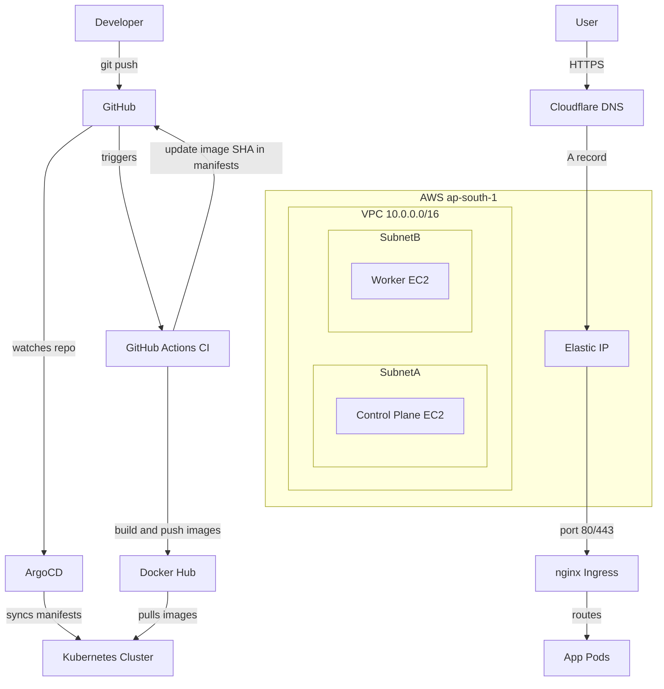
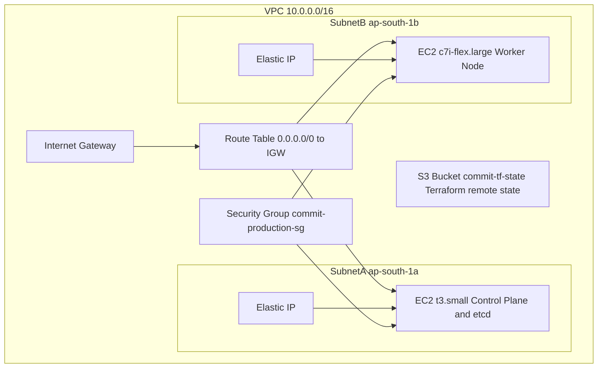
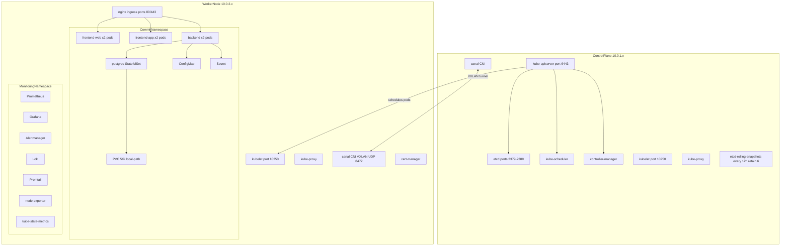
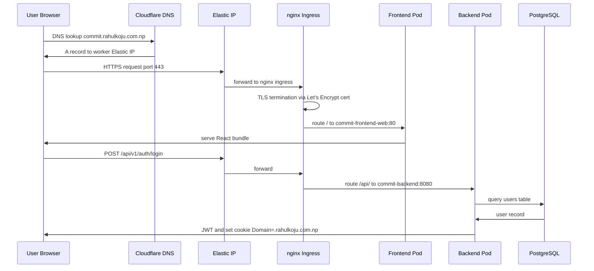
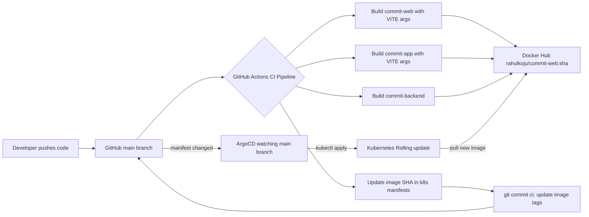
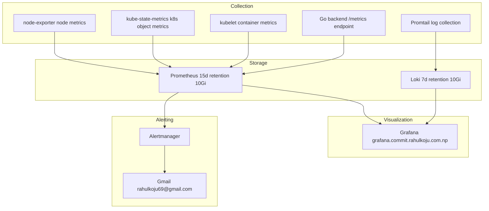
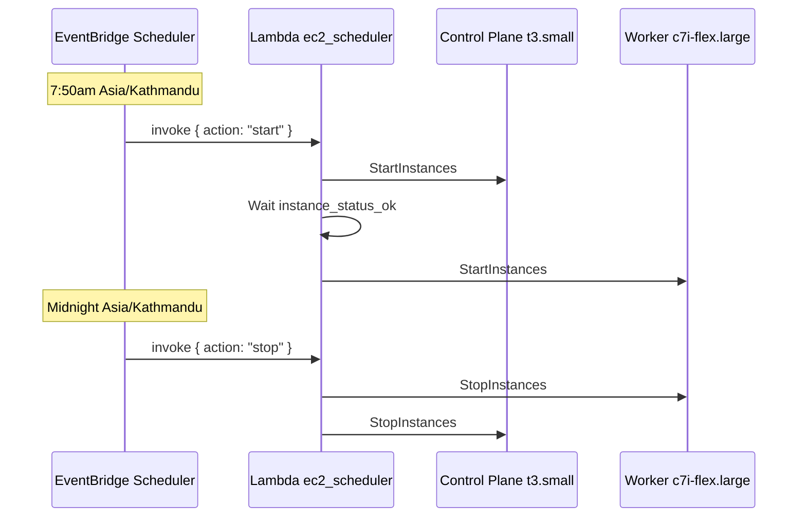
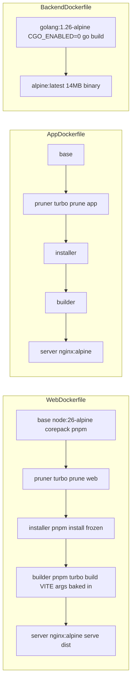

# Architecture

## Overview

Commit runs as a three-tier application on a 2-node Kubernetes cluster provisioned on AWS EC2 in the Mumbai region (`ap-south-1`). The infrastructure is fully defined as code — Terraform provisions AWS resources, Ansible configures nodes, and RKE bootstraps Kubernetes. Application deployments are managed by ArgoCD using a GitOps model — any change merged to `main` is automatically reconciled to the cluster.

---

## High-Level Architecture

---

## AWS Infrastructure

**Security Group Rules — Ingress:**

| Rule | Port | Source | Purpose |
|------|------|--------|---------|
| SSH | 22 | Your IP | Admin access |
| HTTP | 80 | 0.0.0.0/0 | Web traffic |
| HTTPS | 443 | 0.0.0.0/0 | Web traffic |
| K8s API | 6443 | Your IP | kubectl access |
| Internal | All | VPC CIDR | Node-to-node communication (etcd, kubelet, Canal VXLAN) |

**Security Group Rules — Egress:**

Egress is restricted to only what the cluster needs — DNS resolution, outbound HTTPS, and intra-cluster traffic. The previous wide-open `0.0.0.0/0` all-protocol rule was replaced with granular rules to reduce the blast radius of a compromised container.

| Rule | Protocol | Port | Destination | Purpose |
|------|----------|------|-------------|---------|
| internal | all (-1) | all | VPC CIDR | Intra-cluster communication (etcd, kubelet, pod-to-pod) |
| https | TCP | 443 | 0.0.0.0/0 | Container registry pulls, Let's Encrypt ACME, API calls |
| dns_tcp | TCP | 53 | 0.0.0.0/0 | DNS resolution |
| dns_udp | UDP | 53 | 0.0.0.0/0 | DNS resolution |

**EC2 Instance Metadata — IMDSv2:**

EC2 instances enforce IMDSv2 by requiring a session token for metadata access (`http_tokens = "required"`). This prevents SSRF-based credential theft from the instance metadata endpoint (the `169.254.169.254` attack vector).

---

## Kubernetes Cluster

### Container Security Context

All application containers are hardened to follow Kubernetes security best practices and CIS benchmark compliance:

| Property | Value | Purpose |
|----------|-------|---------|
| `runAsNonRoot` | `true` | Prevents containers from running as root |
| `runAsUser` / `runAsGroup` | `10001` (app/frontend), `70` (postgres) | Least-privilege UIDs |
| `readOnlyRootFilesystem` | `true` | Prevents runtime modification of the container image |
| `allowPrivilegeEscalation` | `false` | Blocks SUID/SGID bit escalation |
| `capabilities.drop` | `ALL` | Drops all Linux capabilities |
| `seccompProfile` | `RuntimeDefault` | Applies the container runtime's seccomp filter |

**Frontend containers (app + web):** Since nginx needs to bind port 80 as non-root, the `NET_BIND_SERVICE` capability is added. EmptyDir volumes are mounted at `/var/cache/nginx`, `/var/run`, and `/tmp` to allow nginx to write temp/cache files on a read-only rootfs.

**Backend container:** Full read-only rootfs, non-root, all capabilities dropped — no exceptions needed.

**Postgres StatefulSet:** Runs as UID 70 (the `postgres` user) with read-only rootfs and all capabilities dropped. An `initContainer` (`busybox:1.36`) runs as root to `chown -R 70:70` the data directory before postgres starts — this works around `hostPath`/`fsGroup` limitations where Kubernetes cannot recursively change ownership of an existing host directory. EmptyDir volumes are mounted for `/tmp` and `/var/run/postgresql`.

---

## Network and Traffic Flow

---

## GitOps and CI/CD Flow

---

## Observability Stack

**Alert Rules:**

| Alert | Condition | Severity |
|-------|-----------|----------|
| PodCrashLooping | restart rate > 1 per 5min for 5min | critical |
| PodOOMKilled | container terminated with OOMKilled | critical |
| PostgresDown | StatefulSet ready replicas < 1 for 1min | critical |
| DeploymentReplicasMismatch | desired != available for 5min | critical |
| NodeMemoryHigh | memory usage > 85% for 5min | warning |
| NodeCPUHigh | CPU usage > 85% for 5min | warning |
| PVCUsageHigh | PVC usage > 80% for 5min | warning |
| HighErrorRate | HTTP 5xx rate > 5% for 5min | warning |

---

## Cluster Schedule

The cluster automatically stops overnight and starts each morning to reduce EC2 running costs from 24/7 to ~16 hours/day.

- **Start:** `cron(50 7 * * ? *)` — control-plane first, then worker
- **Stop:** `cron(0 0 * * ? *)` — worker first, then control-plane
- **Timezone:** Asia/Kathmandu, evaluated natively by EventBridge
- **IAM:** Lambda role scoped to only the two managed instance ARNs
- **Manual override:** `workflow_dispatch` in `.github/workflows/cluster-schedule.yaml` (kept as fallback for demos outside the window)

The GHA scheduled cron triggers were removed and replaced by EventBridge because GitHub's shared runner queue had confirmed platform-level delays and dropped runs during high-load UTC windows, causing the morning start to silently not fire.

---

## Container Architecture

Image sizes: commit-web ~29MB, commit-app ~27MB, commit-backend ~14MB

Both frontend Dockerfiles (web and app) apply `apk update && apk upgrade --no-cache` in the final nginx:alpine stage to pull in security patches for the base image at build time.

---

## Component Responsibilities

| Component | Responsibility |
|-----------|---------------|
| Terraform | Provision VPC, subnets, EC2, Elastic IPs, security groups, S3 state backend, EventBridge Scheduler + Lambda for cluster start/stop |
| Ansible | Install Docker 27.2.x, disable swap, load kernel modules, configure sysctl, disable UFW |
| RKE | Bootstrap Kubernetes v1.28.15, deploy Canal CNI, nginx ingress, CoreDNS, Metrics Server |
| cert-manager | Issue and renew Let's Encrypt TLS certificates automatically |
| local-path-provisioner | Provide PersistentVolumes backed by node local disk |
| ArgoCD | Watch git repo, reconcile cluster state to match manifests on every push |
| GitHub Actions | Build Docker images, tag with commit SHA, update manifests, push to Docker Hub |
| nginx ingress | Route external HTTPS traffic to correct backend services based on hostname and path |
| Canal CNI | Create VXLAN overlay network enabling pod-to-pod communication across nodes |
| Prometheus | Scrape and store metrics from all cluster components and application pods |
| Grafana | Visualize metrics and logs, pre-loaded with Kubernetes and custom app dashboards |
| Loki | Aggregate and index logs from all pods via Promtail |
| Promtail | Tail container logs from node filesystem and ship to Loki with Kubernetes metadata labels |
| Alertmanager | Route alerts from Prometheus rules to Gmail |
| EventBridge Scheduler | Trigger EC2 start at 7:50am and stop at midnight (Asia/Kathmandu) via Lambda |
| Lambda (`ec2_scheduler`) | Start control-plane first (wait for status-ok), then worker; stop worker first, then control-plane |
